# E-Commerce Backend System

A Spring Boot based backend application developed to manage core functionalities of an e-commerce platform such as product management, order handling, and user operations.

## Project Overview

E-Commerce Backend System is a Spring Boot–based application mainly focused on building and managing backend services for an e-commerce platform. It provides structured, reusable, and scalable REST APIs to handle core operations such as managing companies, sellers, products, and customer orders.

The primary focus of this project is on backend development, including API design, request handling, data persistence using Spring Data JPA, and integration with a MySQL database. Along with the backend, the project also includes a simple static frontend page that demonstrates how the APIs work in real time, making it helpful for learning, testing, and demonstration purposes.

This project is ideal for understanding backend architecture, RESTful API development, database integration, and API documentation using Swagger in a practical e-commerce context.

## Project Description

The E-Commerce Backend System is designed to solve the problem of managing and organizing core operations of an online shopping platform through a structured and scalable backend architecture. In many small and medium projects, backend logic often becomes unorganized and difficult to maintain. This project provides a clean, modular backend solution using Spring Boot and REST APIs.

### Problem It Solves
This project helps in handling key backend challenges in an e-commerce system such as product management, order processing, seller management, and company registration. It removes the need for manual data handling by providing automated APIs connected with a database, making the system efficient and reliable.

### Who It Is For
This project is useful for:
- Students learning backend development with Java and Spring Boot  
- Developers who want a reference backend structure for e-commerce applications  
- Anyone who wants to understand RESTful API design with real database integration  
- Backend-focused project demos for interviews and academic submissions  

### Functionalities Provided
The project provides the following major functionalities:
- Admin can register companies and manage sellers  
- Sellers can add, update, delete, and view products  
- Sellers can upload product images and bulk upload product data using CSV  
- Customers can view and search products with filters and pagination  
- Customers can add items to orders and submit orders  
- All APIs are documented and testable using Swagger  
- Frontend UI for visual testing of API functionalities  

## Key Features

- Backend-focused e-commerce system built using Spring Boot.
- RESTful APIs for managing companies, sellers, products, and orders.
- Admin module for company and seller management.
- Seller module for product management (add, update, delete, view).
- Product image upload and retrieval functionality.
- Bulk product upload using CSV files.
- Customer module for browsing products with pagination and keyword search.
- Order management system for creating and submitting customer orders.
- MySQL database integration using Spring Data JPA.
- Automatic database table creation and updates using Hibernate.
- Swagger integration for live API documentation and testing.
- Simple frontend dashboard for visual demonstration of all API functionalities.

## Tech Stack & Versions

- Java: 21  
- Spring Boot: 4.0.0  
- MySQL: 8.0.39 for Win64 on x86_64  
- Hibernate ORM: Via Spring Data JPA  
- Spring Data JPA: Used for database operations  
- Apache Maven: Build and dependency management  
- Swagger: springdoc-openapi for API documentation  
- Frontend: HTML, CSS, JavaScript (Static)  
- Git: Version control system  
- IntelliJ IDEA: Development Environment  


## System Architecture / Design

This project follows a layered architecture pattern using Spring Boot, which separates concerns into different modules for better scalability and maintainability.

### Architecture Flow

Client (Frontend UI / Swagger / Postman)  
→ Controller Layer (Handles HTTP requests and responses)  
→ Service Layer (Contains business logic)  
→ Repository Layer (Handles database operations using Spring Data JPA)  
→ MySQL Database  

Each layer has a clear responsibility, which makes the application easier to maintain, debug, and extend in the future.

### Package Structure

The project is organized into the following packages:

- controller – Contains all REST controllers that handle client requests  
- service – Contains business logic and processing  
- repository – Contains all database interaction interfaces (JPA repositories)  
- model / entity – Contains database entity classes  
- dto – Contains Data Transfer Objects for requests and responses  
- config – Contains configuration classes (Swagger, etc.)  
- exception – Handles custom exceptions and global error handling  

### Flow Explanation

1. The client sends a request using Frontend UI, Swagger, or Postman.  
2. The Controller layer receives the request and validates input.  
3. The Service layer processes the logic.  
4. The Repository layer interacts with the MySQL database.  
5. The response is sent back to the client in a structured JSON format.  

This structure makes the project modular, scalable, and easy to modify or extend.

## Prerequisites

Before installing and running this project, make sure the following software and tools are installed on your system:

- Java JDK 21  
- MySQL Server (Version 8)  
- Apache Maven (Latest stable version)  
- Git  
- IntelliJ IDEA (Community or Ultimate Edition)  
- Web Browser (Google Chrome / Edge / Firefox)  
- Postman (Optional, for API testing)  

Make sure all these tools are properly installed and configured before proceeding with the project setup.

## Complete Installation Guide (For Fresh Systems)

This section explains how to install all required software step-by-step using official websites.

---

## 1. Installing Java 21

1. Download Java 21 from the official website:  
   https://www.oracle.com/java/technologies/downloads/

   OR OpenJDK alternative:  
   https://jdk.java.net/21/

2. Run the installer and complete the setup.

3. Set the `JAVA_HOME` environment variable:

For Windows:
- Open Control Panel → System → Advanced System Settings  
- Click Environment Variables  
- Under System Variables click "New"  

Variable name:  
JAVA_HOME  

Variable value (example):  
C:\Program Files\Java\jdk-21  

Now edit Path variable:
- Click Path → Edit → New  
- Add:  
%JAVA_HOME%\bin  

4. Verify installation by running this in terminal:
java -version

---

## 2. Installing MySQL

1. Download MySQL Installer from official website:  
   https://dev.mysql.com/downloads/installer/

2. Install MySQL Server and MySQL Workbench using "Developer Default" option.

3. During installation, set a **root password** (you must remember this).

4. Start MySQL server from Windows Services if it is not running.

5. Open MySQL Workbench and create the database:

Database name:  
minorproject

---

## 3. Installing Apache Maven

1. Download Maven from official site:  
   https://maven.apache.org/download.cgi

2. Download the Binary ZIP file.

3. Extract it to a folder like:  
C:\Program Files\Apache\Maven

4. Set environment variables:

Add new system variable:
MAVEN_HOME = C:\Program Files\Apache\Maven\apache-maven-3.x.x

Edit Path variable and add:
%MAVEN_HOME%\bin

5. Verify installation:
mvn -v

---

## 4. Installing Git

1. Download Git from official website:  
   https://git-scm.com/downloads

2. Run the installer and keep default settings.

3. Verify installation:
git --version

---

## 5. Installing IntelliJ IDEA

1. Download IntelliJ IDEA from JetBrains official website:  
   https://www.jetbrains.com/idea/download/

2. Download the Community Edition (free).

3. Install and launch IntelliJ.

4. Open your project by clicking:
File → Open → Select your project folder.

---

## 6. Swagger Setup

Swagger is already configured in this project using `springdoc-openapi`.

After running the project, open:

http://localhost:8080/swagger-ui.html

Swagger is used for:
- API documentation  
- API testing  
- Viewing request/response schemas  
- Testing endpoints live  

---

## 7. Final Environment Checklist

Before running the project, make sure:

Java 21 is installed  
MySQL Server is running  
Database `minorproject` is created  
Maven is installed  
Git is installed  
IntelliJ IDEA is installed  
Swagger is accessible after project starts  

---

After completing all above steps, you can move to the project setup and run instructions.


## Installation & Setup Guide

Follow these steps to set up and run the project on your local machine.

### Step 1: Clone the Repository

Open terminal or Git Bash and run:

git clone https://github.com/your-username/e-commerce-backend-system.git  
cd e-commerce-backend-system

---

### Step 2: Create MySQL Database

1. Open MySQL Workbench or MySQL Command Line.
2. Login using your MySQL username and password.
3. Create a database with the name:

minorproject

---

### Step 3: Configure Database Settings

Open the following file:

src/main/resources/application.properties

Update these values:

spring.datasource.url = jdbc:mysql://localhost:3306/minorproject  
spring.datasource.username = your_mysql_username  
spring.datasource.password = your_mysql_password  

This step is very important.  
Make sure you change the username and password according to your system.

---

### Step 4: Open Project in IntelliJ IDEA

1. Open IntelliJ IDEA.
2. Click on "Open".
3. Select the project folder you cloned.
4. Wait for Maven to download all required dependencies.

---

### Step 5: Run the Application

You can run the project using either IntelliJ or terminal.

Using IntelliJ:
- Go to your main Spring Boot class.
- Click on the Run button.

Using Terminal:
- In the project folder run:

mvn clean install  
mvn spring-boot:run  

---

### Step 6: Verify the Application

Once the application starts successfully, open your browser and check:

Application URL:  
http://localhost:8080  

Swagger URL:  
http://localhost:8080/swagger-ui.html  

Frontend UI:  
http://localhost:8080/content/user-interface.html  

---

### Step 7: Stop the Application

To stop the application:
- Press Ctrl + C in terminal  
- Or click Stop button in IntelliJ  

---

Now your project should be successfully running on your local machine.

## Database Configuration

Before running this project, you must configure your MySQL database connection.

### Database Name

The database used in this project is:

minorproject

If it does not exist, create it in MySQL:

CREATE DATABASE minorproject;

and then,

USE minorproject;

---

### How to Configure Username and Password

Open the following file inside your project:

src/main/resources/application.properties

Find the database configuration section and update it according to your system.

You must change:
- MySQL username
- MySQL password

Because every system has different credentials.

---

### Sample application.properties Configuration

Below is the sample configuration format:

spring.datasource.url=jdbc:mysql://localhost:3306/minorproject  
spring.datasource.username=YOUR_MYSQL_USERNAME  
spring.datasource.password=YOUR_MYSQL_PASSWORD  

spring.jpa.hibernate.ddl-auto=update  
spring.jpa.show-sql=true  
spring.jpa.properties.hibernate.dialect=org.hibernate.dialect.MySQL8Dialect

---

### Important Notes

- Change `YOUR_MYSQL_USERNAME` to your actual MySQL username.  
- Change `YOUR_MYSQL_PASSWORD` to your actual MySQL password.  
- If MySQL runs on a different port, replace `3306` with your port number.  
- If MySQL is not on localhost, replace `localhost` with your server IP address.

Example for different port:

spring.datasource.url=jdbc:mysql://localhost:3307/minorproject

Example for other host:

spring.datasource.url=jdbc:mysql://192.168.1.50:3306/minorproject


## Swagger (API Documentation Setup)

Swagger is integrated in this project using `springdoc-openapi` to provide interactive API documentation and testing.

---

### Swagger Dependency

The following Swagger dependency is used in the project:

<dependency>
    <groupId>org.springdoc</groupId>
    <artifactId>springdoc-openapi-starter-webmvc-ui</artifactId>
</dependency>

This dependency automatically configures Swagger UI and OpenAPI documentation.

---

### Swagger URL

After starting the project, you can access Swagger here:

http://localhost:8080/swagger-ui.html  

Or:  
http://localhost:8080/swagger-ui/index.html  

OpenAPI JSON Endpoint:  
http://localhost:8080/v3/api-docs  

---

### How to Use Swagger

Once the application is running:

1. Open your browser and go to:
   http://localhost:8080/swagger-ui.html  

2. You will see a list of all API endpoints grouped by controllers.

3. Click on any API endpoint to expand it.

4. Click the "Try it out" button.

5. Enter the required data in fields or body (JSON format).

6. Click on "Execute" to send the API request.

7. You will see:
   - Server response
   - Response body
   - Status code
   - Headers

Swagger is useful for:
- Testing APIs without Postman  
- Understanding request and response formats  
- Viewing DTO schemas and models  
- Debugging b


## API Endpoints

This section lists all the main API endpoints grouped by their role and purpose.

---

### Admin APIs

These APIs are used by the Admin to manage companies and sellers.

- POST  /api/admin/company  
  → Register a new company  

- POST  /api/admin/seller  
  → Create a new seller  

- GET   /api/admin/seller  
  → Get all sellers  

- DELETE /api/admin/seller/{id}  
  → Delete a seller by ID  

Example:
http://localhost:8080/api/admin/seller/90  

---

### Seller APIs

These APIs are used by Sellers to manage products.

- POST  /api/seller/addProduct  
  → Add a new product  

- GET   /api/seller/product  
  → Get all products  

- GET   /api/seller/product/{id}  
  → Get product by ID  

- PUT   /api/seller/product/{id}  
  → Update product  

- DELETE /api/seller/product/{id}  
  → Delete product  

- POST  /api/seller/product/image  
  → Upload product image  

- POST  /api/seller/product/bulk  
  → Upload products in bulk using CSV  

Examples:  
http://localhost:8080/api/seller/product/3  
http://localhost:8080/api/seller/product/4  

---

### Customer APIs

These APIs are used by customers to browse products and place orders.

- GET  /api/customer/products  
  → Fetch all products  

- GET  /api/customer/products?keyword=S24&pageSize=3&pageNo=0  
  → Search products with keyword and pagination  

- POST /api/customer/order-item  
  → Add products to order  

- PUT  /api/customer/orders/{orderId}/submit  
  → Submit order  

Example:  
http://localhost:8080/api/customer/orders/1/submit  

---

### File / Image APIs

These APIs handle product images and static file access.

- GET /content/{imageName}  
  → Access uploaded images  

Example image URL:  
http://localhost:8080/content/93f36792-be22-45e0-973c-f94bed52ee25_furniture.webp  

---

All APIs are documented and testable using Swagger UI.


## Frontend Demo Page

A simple frontend UI is included in this project to demonstrate how all backend APIs are working.

---

### File Name

The frontend file name is:  
user-interface.html

---

### URL

Once the application is running, you can access the frontend demo page at:

http://localhost:8080/content/user-interface.html

---

### Location Inside Project

The file is located inside the project at:

src/main/resources/static/content/user-interface.html

All required static files like CSS, JavaScript, and images are placed inside the `static` folder.

---

### Purpose

This frontend page is created only for demonstration and testing purposes.

It helps to:
- Visually test API functionality
- Demonstrate request and response flow
- Show how backend APIs interact with UI
- Make it easier to understand the working of the backend system

The main focus of this project is backend development, and this frontend is just a supporting demo interface.


## How to Run the Project

You can run this project using either an IDE (like IntelliJ IDEA) or directly from the terminal.

---

### Run Using IDE (IntelliJ IDEA)

1. Open IntelliJ IDEA.
2. Click on **Open** and select your project folder.
3. Wait for Maven to download all dependencies.
4. Locate the main class (the class with `@SpringBootApplication` annotation).
5. Right-click on it and select **Run**.

Your application will start on:  
http://localhost:8080

After startup, you can access:
- Swagger UI: http://localhost:8080/swagger-ui.html  
- Frontend UI: http://localhost:8080/content/user-interface.html  

---

### Run Using Terminal

1. Open terminal inside your project directory.
2. Execute the following commands:

```properties

mvn clean install
mvn spring-boot:run
```


3. Wait for the Spring Boot application to start.

Once started, the application will be available at:

http://localhost:8080

---

### Stopping the Application

- If running in terminal: press **Ctrl + C**
- If running in IntelliJ: click the **Stop** button

---

Now your project is ready to be used and tested.


## How to Generate and Run JAR File

This section explains how to create a runnable JAR and execute it.

---

### Generate JAR File

1. Open terminal inside your project folder.
2. Run the following command:

mvn clean package

3. After the build is completed, go to the `target` folder.
4. You will find a JAR file like:

e-commerce-backend-system.jar

---

### Run JAR File

1. Open terminal inside the `target` folder.
2. Run this command:

java -jar e-commerce-backend-system.jar

3. Your application will start on:

http://localhost:8080

---

### Important Note While Running JAR

Before running the JAR file:
- Make sure MySQL server is running.
- Make sure database credentials in `application.properties` are updated.
- Port `8080` should be free.

After that, you can access:
- Swagger UI: http://localhost:8080/swagger-ui.html  
- Frontend UI: http://localhost:8080/content/user-interface.html  


## Common Errors and Troubleshooting

Here are some common issues and their solutions:

---

### 1. Port 8080 Already in Use

Error:
Port 8080 is already in use.

Solution:
- Stop the application that is using port 8080.
- OR change the port in application.properties:
  server.port=9090

---

### 2. Database Connection Failed

Error:
Cannot connect to database.

Solution:
- Make sure MySQL Server is running.
- Check database name: minorproject
- Verify username and password in application.properties.
- Check MySQL port (default is 3306).

---

### 3. Swagger Not Opening

Problem:
Swagger UI not loading.

Solution:
- Make sure your application is running.
- Open correct URL:  
  http://localhost:8080/swagger-ui.html

---

### 4. JAR File Not Running

Problem:
JAR file fails to start.

Solution:
- Verify Java version is 21 using:  
  java -version  
- Make sure JAVA_HOME is set correctly.
- Check database connection before starting JAR.

---

### 5. Dependency Errors

Problem:
Project fails during build.

Solution:
- Run:
```properties
mvn clean install
```
    
- Make sure your internet connection is active for downloading dependencies.

## How to Build JAR File

To generate a JAR file of this project, follow these steps:

1. Open terminal inside the project directory.
2. Run the following command:

```properties
mvn clean package
```
3. After the build is completed, go to the `target` folder.
4. You will find a runnable JAR file inside it.

You can use this JAR file to run the project without using an IDE.
## How to Run JAR File

After generating the JAR file, you can run it using the following command:

java -jar your-jar-file-name.jar

Example:

java -jar e-commerce-backend-system.jar

Make sure before running the JAR:
- MySQL server is running.
- Database configuration (username and password) is correct.
- Port 8080 is free.

Once the JAR starts successfully, access your application at:

http://localhost:8080

Swagger UI:  
http://localhost:8080/swagger-ui.html  

Frontend Demo Page:  
http://localhost:8080/content/user-interface.html  

## Frontend UI Screenshots

Below are the frontend demonstration screenshots organized in the same order as your uploaded files.

### FE1 – Dashboard / Home
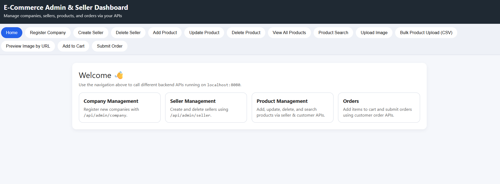

### FE2 – Register Company
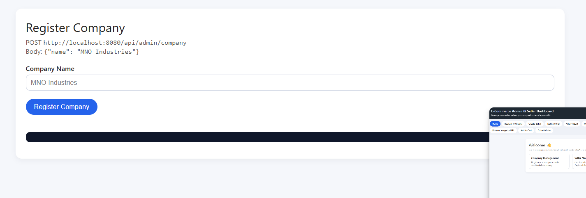

### FE3 – Create Seller
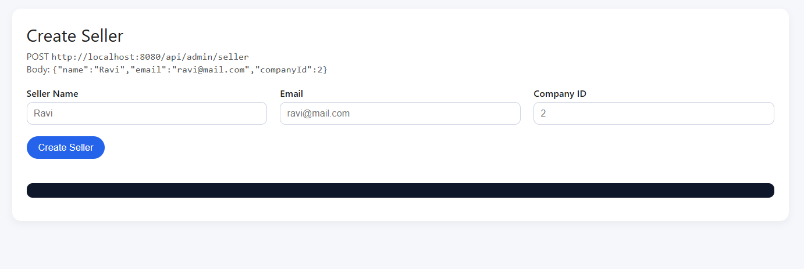

### FE4 – Delete Seller
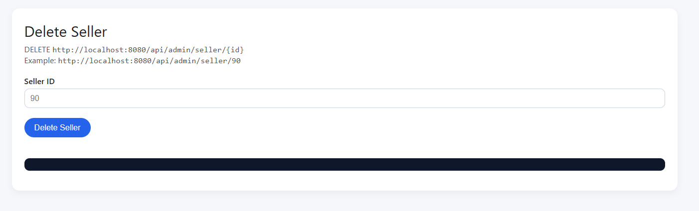

### FE5 – Add Product
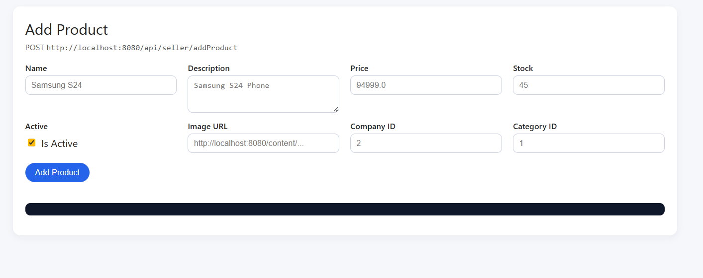

### FE6 – Update Product
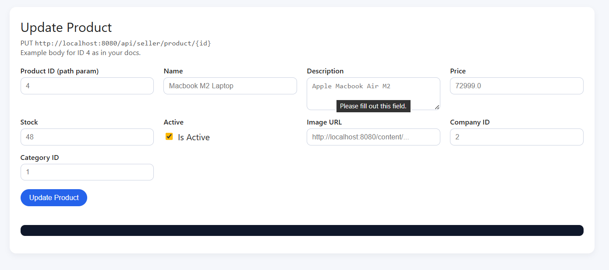

### FE7 – Delete Product
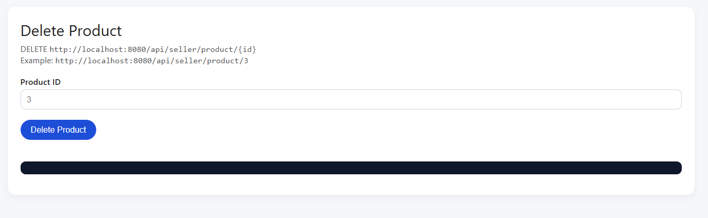

### FE8 – View All Products
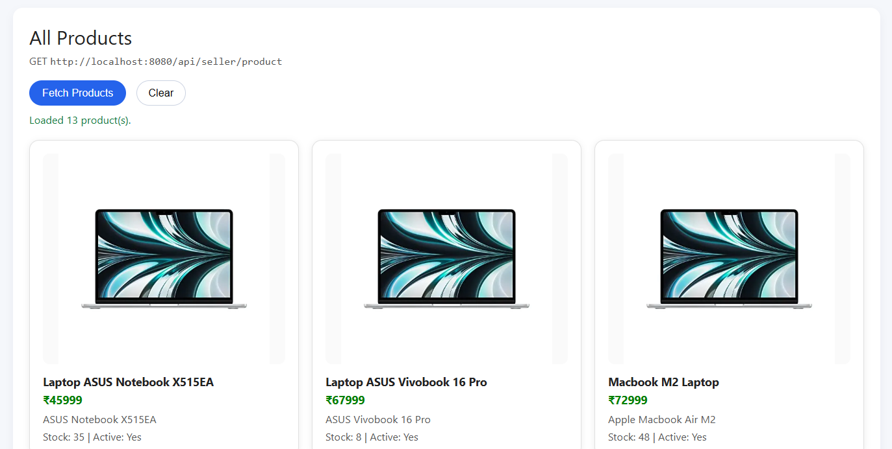

### FE9 – Product Search
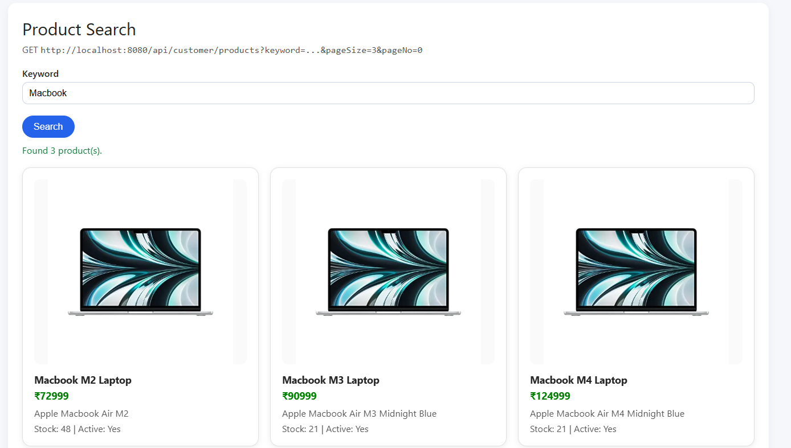

### FE10 – Upload Product Image
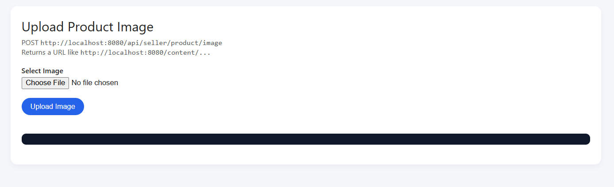

### FE11 – Bulk Product Upload (CSV)
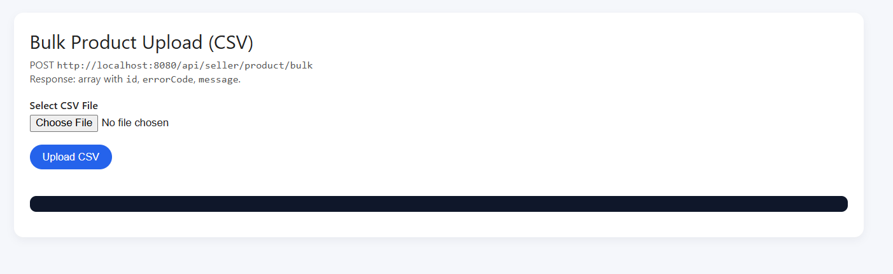

### FE12 – Add to Cart
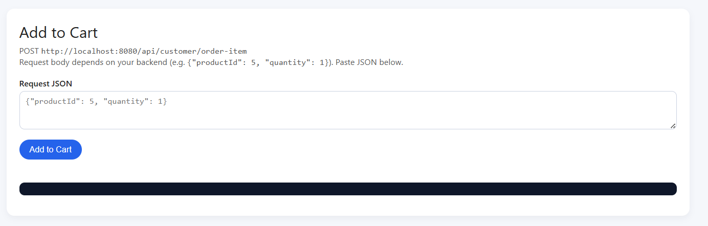

### FE13 – Submit Order
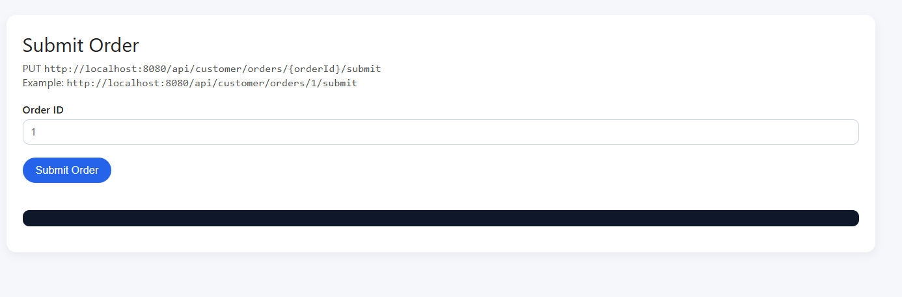
## Swagger UI Screenshots

Below are the Swagger API documentation screenshots as stored in the project.

### Sw1 – Swagger API Overview
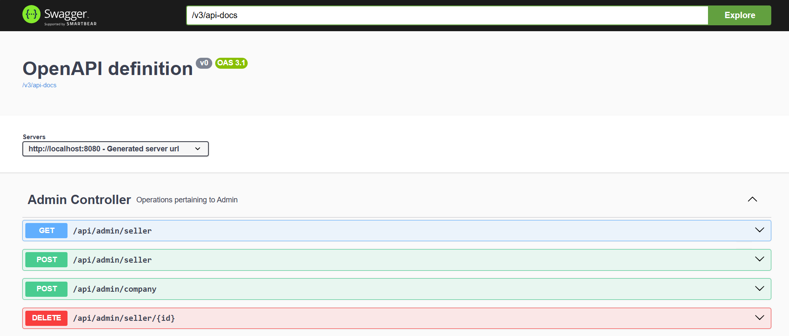

### Sw2 – All Controller Endpoints
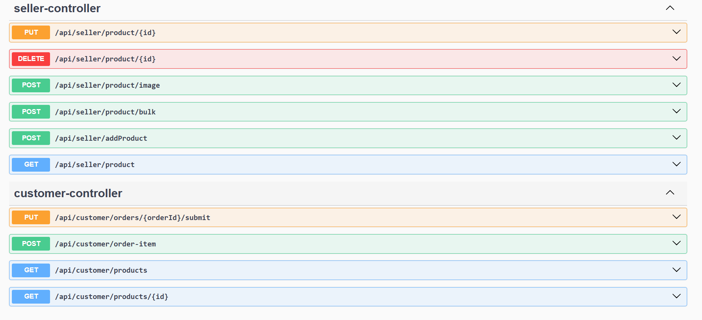

### Sw3 – Swagger Schema (Part 1)
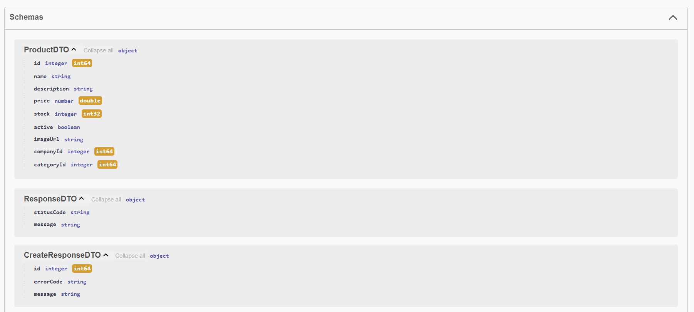

### Sw4 – Swagger Schema (Part 2)
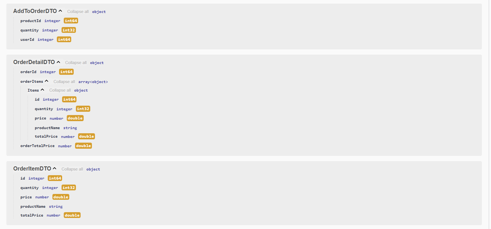

### Sw5 – Swagger Schema (Part 3)
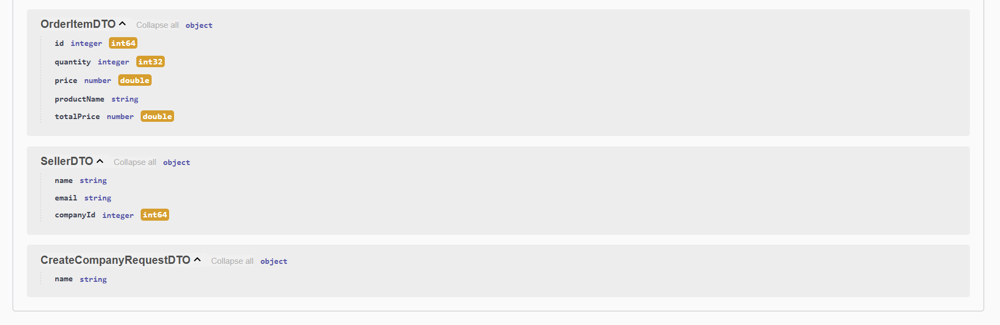

## Project Structure (Visual View)

Here is the visual representation of the complete project folder structure:


